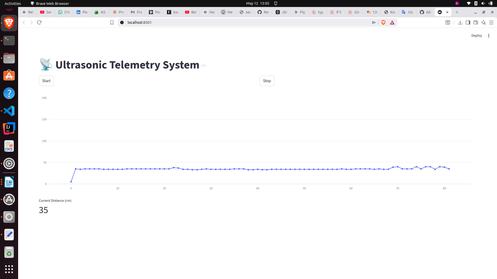
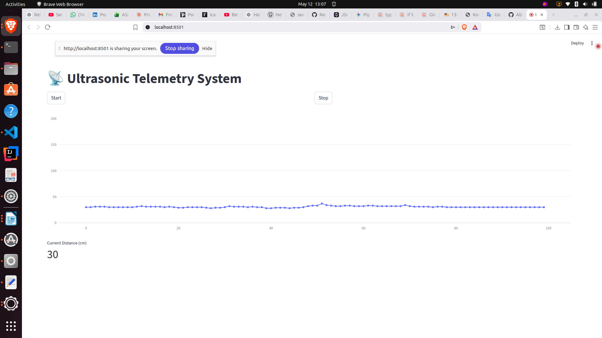
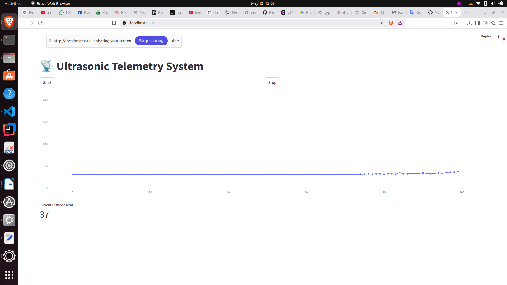
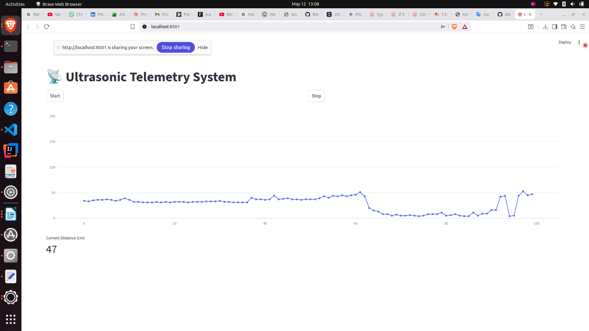
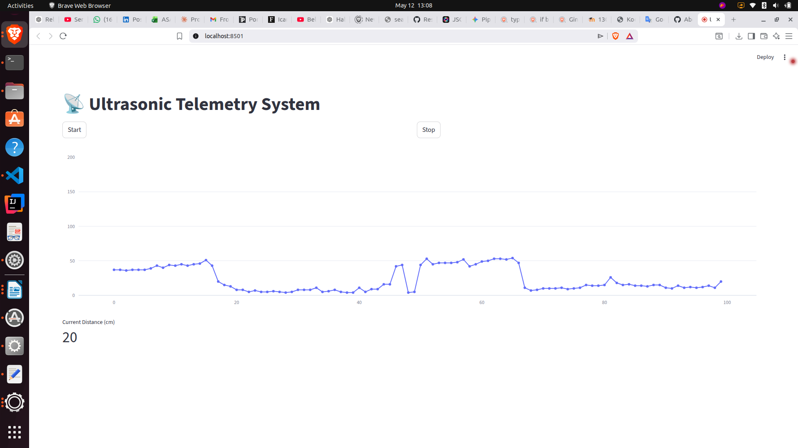
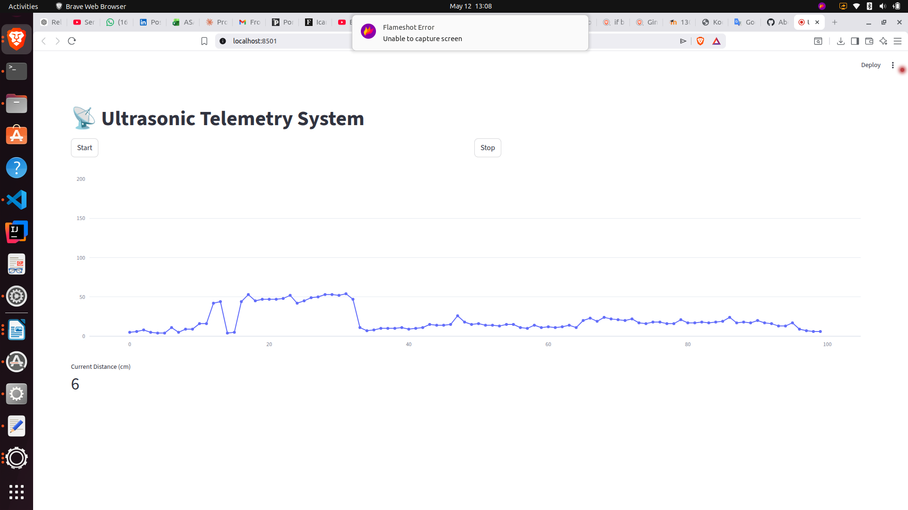
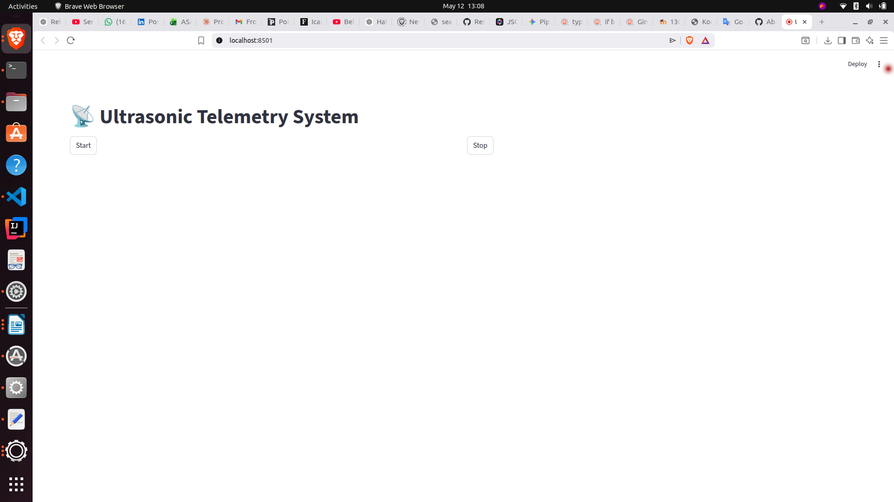
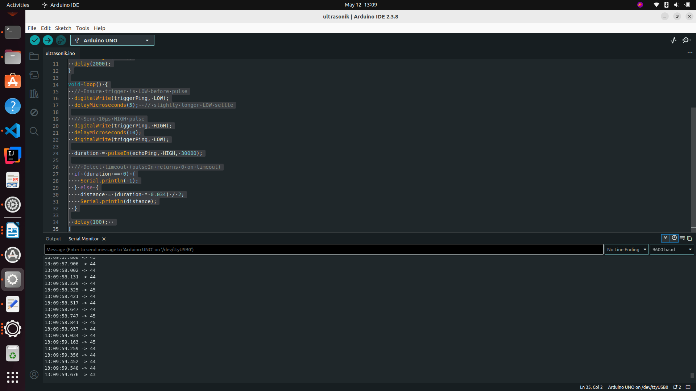

# 📡 Ultrasonic Telemetry System

A real-time distance measurement and serial telemetry project using an HC-SR04 ultrasonic sensor and Arduino Uno.

---

## 📋 Project Overview

This project measures distance using an HC-SR04 ultrasonic sensor and transmits the data to a computer via serial communication. The incoming data can be visualized in real time using the Arduino IDE Serial Monitor, Serial Plotter, or optionally a Python/Streamlit-based dashboard.

---

## 🛠️ Hardware Requirements

| Component | Description |
|---|---|
| Arduino Uno | Microcontroller board |
| HC-SR04 Ultrasonic Sensor | Used for distance measurement |
| Jumper Wires | For circuit connections |
| USB Cable | Arduino ↔ Computer connection |
| Breadboard | For circuit assembly |

---

## 💻 Software Requirements

| Software | Purpose |
|---|---|
| [Arduino IDE](https://www.arduino.cc/en/software) | Code development and upload |
| Serial Monitor | View raw serial data |
| Serial Plotter | Real-time graphical display |
| Python + Streamlit *(optional)* | Advanced dashboard visualization |

---

## 🔌 Wiring / Circuit Diagram

Connect the HC-SR04 sensor to the Arduino Uno as follows:

| HC-SR04 Pin | Arduino Uno Pin |
|---|---|
| VCC | 5V |
| GND | GND |
| TRIG | D13 |
| ECHO | D12 |

---

## ⚙️ How It Works

The HC-SR04 sensor emits an ultrasonic pulse and listens for the echo. The time-of-flight of the sound wave is used to calculate distance.

**Step-by-step flow:**

1. A short HIGH pulse is sent to the **TRIG** pin to trigger a measurement.
2. The sensor emits an ultrasonic burst.
3. The **ECHO** pin goes HIGH for the duration of the round-trip travel time.
4. The Arduino reads the pulse duration and converts it to distance.
5. The result is sent to the computer over the serial port at 9600 baud.

**Distance Formula:**

```
Distance (cm) = (Duration (µs) × 0.034) / 2
```

- `Duration` — Echo pin pulse width in microseconds
- `0.034` — Speed of sound in cm/µs
- `÷ 2` — Accounts for the round trip (out and back)

---

## 🖼️ Quick Views

Here are all project preview images from the `quick-views/` folder.

















## 🚀 Getting Started

### 1. Clone or Download the Project

```bash
git clone https://github.com/AboubacarSow/ultrasonic-telemetry-system.git
cd ultrasonic-telemetry-system
```

### 2. Upload the Code

1. Open `ultrasonik.ino` in Arduino IDE.
2. Select **Tools → Board → Arduino Uno**.
3. Select the correct COM port under **Tools → Port**.
4. Click **Upload**.

### 3. View the Data

- Open **Serial Monitor** (`Ctrl+Shift+M`) at **9600 baud** to see raw distance readings.
- Open **Serial Plotter** (`Ctrl+Shift+L`) for a live graph.

---

## 📄 Source Code

```cpp
long duration;
int distance;

const int triggerPing = 10;
const int echoPing    = 11;

void setup() {
  pinMode(triggerPing, OUTPUT);
  pinMode(echoPing, INPUT);
  Serial.begin(9600);
}

void loop() {
  // Send trigger pulse
  digitalWrite(triggerPing, LOW);
  delayMicroseconds(2);
  digitalWrite(triggerPing, HIGH);
  delayMicroseconds(10);
  digitalWrite(triggerPing, LOW);

  // Read echo duration and calculate distance
  duration = pulseIn(echoPing, HIGH);
  distance = (duration * 0.034) / 2;

  Serial.print("Distance: ");
  Serial.println(distance);

  delay(100);
}
```

---

## 🐍 Optional: Python/Streamlit Visualization

Install dependencies:

```bash
pip install pyserial streamlit
```

Run the visualization (adjust the port as needed):

```bash
streamlit run visualization.py
```

> Make sure the Arduino IDE Serial Monitor is **closed** before running the Python script — only one application can hold the serial port at a time.

---

## 🐛 Known Issues & Troubleshooting

| Problem | Solution |
|---|---|
| CH340 driver not found (Linux) | Install the CH340 driver manually |
| `brltty` blocks the serial port | Run `sudo systemctl disable brltty` |
| Sensor always reads `0` | Check TRIG/ECHO wiring and power supply |
| Garbled characters in Serial Monitor | Ensure baud rate is set to **9600** |
| COM / ttyUSB port not visible | Try a different USB cable; check USB permissions |

**Linux permission fix (if port access is denied):**

```bash
sudo usermod -aG dialout $USER
# Log out and back in for changes to take effect
```

---

## 📁 Project Structure

```
ultrasonic-telemetry/
├── ultrasonik.ino   # Main Arduino sketch
├── visualization.py               # Optional Python/Streamlit visualizer
└── README.md                  # This file
```

---

## 📚 References

- [Arduino Official Documentation](https://docs.arduino.cc/)
- [HC-SR04 Ultrasonic Sensor Datasheet](https://cdn.sparkfun.com/datasheets/Sensors/Proximity/HCSR04.pdf)
- [Arduino IDE Documentation](https://docs.arduino.cc/software/ide-v2)
- [Serial Communication Basics – Arduino](https://docs.arduino.cc/learn/communication/uart)

---

## 📜 License

This project was developed as an academic coursework submission for the **Communication Systems** course, Department of Information System Engineering.

Feel free to use and adapt it for educational purposes.